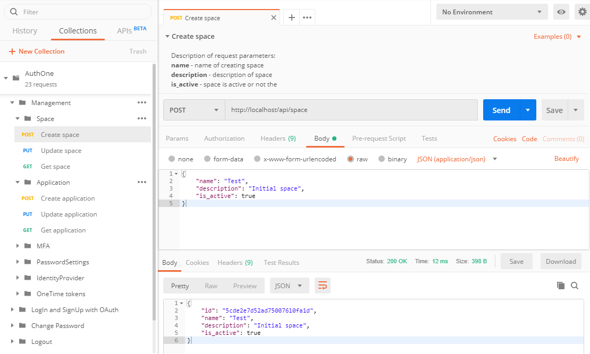
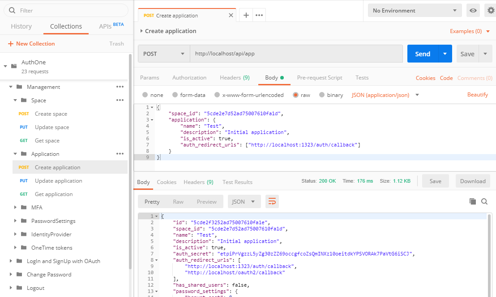

# AuthOne

[](https://opensource.org/licenses/Apache-2.0)
[](https://travis-ci.com/qilin/auth1.protocol.one)
[](https://codecov.io/gh/qilin/auth1.protocol.one)
[](https://goreportcard.com/report/github.com/qilin/auth1.protocol.one)


**AuthOne** is an open-source authorization server that supports the OAuth 2.0 and OpenID 1.0 Connect paradigm, created based on the [ORY Hydra](https://github.com/ory/hydra) open source protected and certified application. 
The server is used as an external service according to OAuth authorization standards.

---

## Table of Contents

- [Installation](#installation)
- [Configuration](#configuration)
- [Usage](#usage)
- [Getting Started](#getting-started)
- [API](#api)
- [License](#license)

## Installation

For the authorization server to work, you will need:
- [Go](https://golang.org/)
- [MongoDB](https://www.mongodb.com/)
- [Redis](https://redis.io/)
- [ORY Hydra](https://github.com/ory/hydra) and its dependencies.
- Server to send mail

You can install all services separately, or use the prepared Docker for a comprehensive installation of all components. 
The docker-compose file contains the basic configuration of the application, which you can modify to suit your needs. 
You can also use Dockerfile to install the server using Kubernetes.

If you install the Hydra yourself (not through the docker-compose file), then note that in order to work, it needs two 
ports to serve public and administrative requests. As a rule, the Hydra service is proxied through nginx and public 
access is provided only to public methods (see the configuration example in the `etc/nginx/default.template` file). 
Calls to administrative methods are available only from the internal subnet for security purposes.

## Configuration

To start the application, configure the following environment variables:

| Variable                         | Default               | Description                                                                                                                                |
|----------------------------------|-----------------------|--------------------------------------------------------------------------------------------------------------------------------------------|
| AUTHONE_SERVER_PORT              | 8080                  | HTTP port to listed API requests.                                                                                                          |
| AUTHONE_SERVER_DEBUG             | true                  | Enable logmode for Postgress.                                                                                                              |
| AUTHONE_SERVER_ALLOW_ORIGINS     | *                     | Comma separated list of [CORS domains](https://developer.mozilla.org/en-US/docs/Web/HTTP/Headers/Access-Control-Allow-Origin).             |
| AUTHONE_SERVER_ALLOW_CREDENTIALS | true                  | Look at [CORS documentation](https://developer.mozilla.org/en-US/docs/Web/HTTP/Headers/Access-Control-Allow-Credentials) about this value. |
| AUTHONE_DATABASE_HOST            | 127.0.0.1             | The domain name or the server IP address for connecting to database.                                                                       |
| AUTHONE_DATABASE_DATABASE        | auth-one              | Name of database for connection.                                                                                                           |
| AUTHONE_DATABASE_USER            |                       | Username to connect to the database.                                                                                                       |
| AUTHONE_DATABASE_PASSWORD        |                       | Password to connect to the database.                                                                                                       |
| AUTHONE_DATABASE_MAX_CONNECTIONS | 100                   | Maximum number of database connections per session.                                                                                        |
| AUTHONE_SESSION_SIZE             | 1                     | Maximum number of idle connections in the pool of redis session.                                                                           |
| AUTHONE_SESSION_NETWORK          | tcp                   | Type of network for connection to the redis.                                                                                               |
| AUTHONE_SESSION_SECRET           | secretkey             | Key for generation secure cookie string.                                                                                                   |
| AUTHONE_SESSION_NAME             | sessid                | The name of the variable to store session data in cookies.                                                                                 |
| AUTHONE_SESSION_ADDRESS          | 127.0.0.1:6379        | Address to connect to the redis server.                                                                                                    |
| AUTHONE_SESSION_PASSWORD         |                       | Password to connect to the redis server.                                                                                                   |
| AUTHONE_HYDRA_PUBLIC_URL         | http://localhost:4444 | The address of the Hydra server where the public API is located.                                                                           |
| AUTHONE_HYDRA_ADMIN_URL          | http://localhost:4445 | The address of the Hydra server where the administration API is located.                                                                   |
| AUTHONE_REDIS_ADDRESS            | 127.0.0.1:6379        | Address to connect to the radis server.                                                                                                    |
| AUTHONE_REDIS_PASSWORD           |                       | Password to connect to the radis server.                                                                                                   |
| AUTHONE_MAILER_HOST              | localhost             | Email server host.                                                                                                                         |
| AUTHONE_MAILER_PORT              | 25                    | Email server port.                                                                                                                         |
| AUTHONE_MAILER_USERNAME          |                       | Email server username. Here is no default value, it should be provided.                                                                    |
| AUTHONE_MAILER_PASSWORD          |                       | Email server password. Here is no default value, it should be provided.                                                                    |
| AUTHONE_MAILER_REPLY_TO          |                       | Reply-to value. Here is no default value, it may be provided.                                                                              |
| AUTHONE_MAILER_FROM              |                       | From value. Here is no default value, it may be provided.                                                                                  |
| AUTHONE_MAILER_SKIP_VERIFY       | true                  | Skip validate TLS on mail server connection.                                                                                               |
| AUTHONE_MIGRATION_DIRECT         |                       | Used to migrate a database. If not specified, no migration is used. Acceptable values of up and down.                                      |
| AUTHONE_AUTH_WEB_FORM_SDK_URL    |                       | URL to the java-script file with SDK authorization.                                                                                        |

> **Attention!** Do not forget that ORY Hydra provides its configuration parameters that also need to be configured. 
For more information on this, see the [ORY Hydra project website](https://github.com/ory/hydra).

## Usage

Compile the application into an executable file and run it with the `server` key or run it from the command line 
`go run main.go server`. After you open the browser and go to the main server authorization page 
(for example, https://localhost), you should see the message `Welcome to Auth1!`.

Using the [API](#api), you need to create a space, an application and, if necessary, adjust its parameters (criteria for 
passwords, the duration and expiration of one-time tokens, identity providers for user accounts, etc.).

### What is Space?

Space is the union of one or more applications within a single ecosystem.
This can often be required to separate users in different projects (for example, site A and site B) for sharing access 
or issuing access to a project by invitation. Within each project, it is possible to customize the user pool, whether 
they will be common to the space or only within the application. For example, in application A and B, it is set in the 
settings that users are shared, then using registered in project A can log in with their credentials in project B. 

Each application has its own settings and authorization capabilities (using login and password, social authorizations, 
hereinafter SAML, and others), which allows you to fully customize the application for the needs of the project.

In order to register or authorize a user, you must redirect him to the authorization server’s address `/oauth2/auth` 
and transfer the standard set of parameters that the oauth2 protocol supports (use any oauth authorization library for 
the language you need). The user will be prompted to enter a username and password, register or log in using an external 
social network. 

After successfully completing this procedure, the user will be moved to the page to accept consent to scopes to 
the application. After that, it will be redirected to the address specified as the reverse in the first request. 
The application should check the received code on the authorization server (by contacting `/oauth2/token`) and receive an 
access token in exchange (depending on the requested rights, the openid token and also the refresh token are returned) 
and its lifetime.

Use the received access token to check its validity and obtain information about the user by sending it to the address 
`/oauth2/introspect`. Validate it in headers on your API methods to control access.

You can integrate authorization not only through redirection to another user page, but use the JS SDK which will allow 
you to register and authorize a user without leaving your site. More information can be found in the 
[ProtocolONE Auth Web SDK](https://github.com/ProtocolONE/auth-web-sdk-embedded) project. 

See an example of use in the demo application located in the 
[AuthOne JWT](https://github.com/ProtocolONE/authone-jwt-verifier-golang) project.

## Getting Started

Here you will find instructions on how to launch an authorization server in a few steps, create an application and 
start registering and authorizing users.

- Start the authorization server using the docker-compose: `docker-compose up`
- Using API and Postman create space.

- Using the resulting space ID, create an application. In the auth_redirect_urls parameter, specify the address to which the user will be redirected after successful registration or authorization.

- In your application (for example, you have a website located at http://localhost:1323) place a link to registration and authorization, using the previously received application identifier and URL to return: 
`http://localhost/oauth2/auth?response_type=code&client_id=5cde2f3252ad75007610fa1e&redirect_uri=http%3A%2F%2Flocalhost%3A1323%2Fauth%2Fcallback&state=customstate`. 
- Prepare a page to which the user will go after the end of registration or authorization (the URL that was previously listed as redirected - `http://localhost:1323/auth/callback`). With the help of any OAuth library, implement code verification and exchange for access tokens.
```
import "golang.org/x/oauth2"

ctx := context.Background()
conf := &oauth2.Config{
    ClientID:     "5cde2f3252ad75007610fa1e",
    ClientSecret: "etpiPrVgzzL5yZg30zZZ69occgfcoZsQmINXz10oeitdkYPSVORAk7PaVtG6iSCJ",
    Endpoint: oauth2.Endpoint{
        AuthURL:  "http://localhost/oauth2/auth",
        TokenURL: "http://localhost/oauth2/token",
    },
}

// Use the authorization code that is pushed to the redirect
// URL. Exchange will do the handshake to retrieve the
// initial access token. The HTTP Client returned by
// conf.Client will refresh the token as necessary.
var code string
if _, err := fmt.Scan(&code); err != nil {
    log.Fatal(err)
}
tok, err := conf.Exchange(ctx, code)
if err != nil {
    log.Fatal(err)
}
```
- Save the received token (if necessary) and request user information on the authorization server. 
The resulting information can be used to display a profile or create a local account.
```
import (
    "fmt"
    "golang.org/x/net/context/ctxhttp"
    "io/ioutil"
    "net/http"
)

req, err := http.NewRequest("GET", "http://localhost/oauth2/userinfo", strings.NewReader(""))
if err != nil {
    log.Fatal(err)
}

req.Header.Set("Accept", "application/json")
req.Header.Set("Authorization", fmt.Sprintf("Bearer %s", t))

r, err := ctxhttp.Do(ctx, http.DefaultClient, req)
if err != nil {
    log.Fatal(err)
}
defer r.Body.Close()

body, err := ioutil.ReadAll(io.LimitReader(r.Body, 1<<20))
if err != nil {
    log.Fatal(err)
}

fmt.Println(body)
```
- Is done. Open the site and go to the registration.

## API

The application management API supports the following functionality:
- Adding, editing and receiving information about the space;
- Adding, editing and receiving information about the application;
- Change settings for password criteria in the application;
- Adding, editing and receiving information about the identity of the provider for the application;
- Getting active for the application identity providers;
- Getting a list of templates for identity providers;
- Adding MFA provider for the application.

For convenience, all API requests are prepared as a [collection](spec/postman_collection) for [Postman](https://www.getpostman.com/)
application where you can see a list of methods, parameters, their description and try to execute them for your copy of 
the authorization server.

## License

The project is available as open source under the terms of the [Apache-2.0 License](https://opensource.org/licenses/Apache-2.0).
